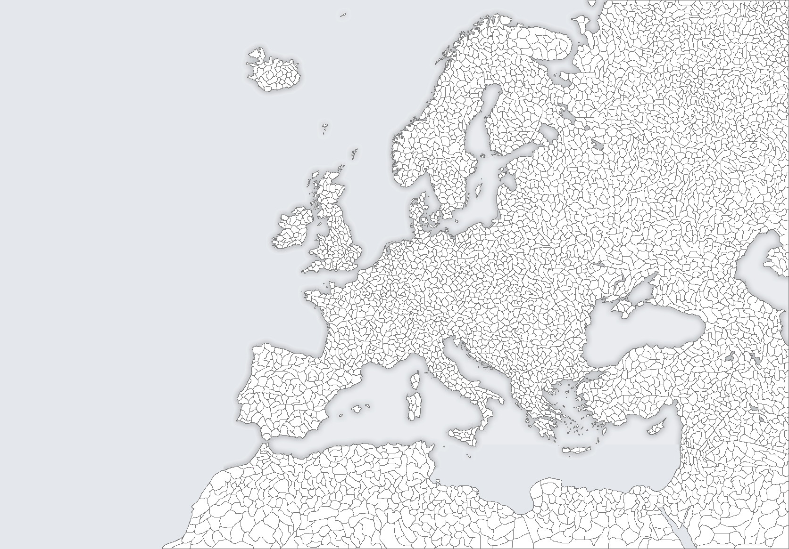

# Intro
The game is supposed to be simple and easy to learn, yet be a bit challenging
and harder to
master – it should be easy to grasp the basics for a new player, but reward
people who put more
thought into their actions, by adding a few not-so-obvious elements.
# Base Rules
## The goal, base gameplay
Players create accounts, choose their country name (+avatars? Anthems for if
they win?) and
colour from one of the available ones (first come first serve). After that they
choose a starting point,
where their country is formed (distance from another country? Fixed starting
points?). The server
waits for all players to preapare/join (time? Server-chosen?). When all the
players are ready the
game starts.

## The Map

## Action points
Players get 'action points' over time (depending on the server- could be every 5
seconds for
a single-session game, could be every hour for a game lasting days-weeks). They
then use these
points to 'attack' territories around their borders. Action points can also be
used to buy different
upgrades (trading? Treaties? Sending points to other players?).

## Attacking
 Attacking other territories can end in a success or a failure.
 -Attacking a region occupied by another nation has a lower chance of success
 -The chance of success while attacking a region increases accordingly to
 neighbouring territories
 occupied by the attacker (the more neighbours the attacker is in control of,
 the higher the chance).
 This increases strategical value of certain territories – sea regions or
 regions in tight spaces have
 less neighbours, thus reducing the chance of attacker conquering the territory
 around and then easily
 finishing off the desired region
 -The chance of success is lowered by the number of neighbouring regions
 controlled by the
 defender
 -The chance of success can be further modified by different upgrades bought by
 defenders/attackers
 -The chance of success can also be modified by territory-specified upgrades
 (e.g. Castles, that could
 be destroyed if the territory gets conquered, removing the bonuses) –do we
 really want this feature
 or would it be too much?
 -Territorial penalties/rewards? - same as above
 
## Upgrades
TBA
 
## Politics, player interaction
Simple messaging? Treaties with conditions? Trading territories?
 
## Victory
A player wins if they control a certain percentage (of all territories)/(over
other players).
Players entering the server at that point are displayed a message with the
winner and/or their
avatar/anthem/message (depending on what we include).
